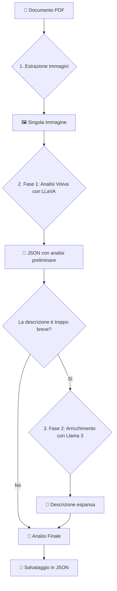

#  Vision Pipeline 2-Phase (High-Quality)

> Una pipeline in due fasi per l'analisi visiva avanzata di immagini estratte da documenti PDF, utilizzando modelli multimodali (LLaVA) e di testo (Llama 3) tramite Ollama.

Questo progetto automatizza l'estrazione e l'analisi di immagini da file PDF. La pipeline è progettata per produrre descrizioni di alta qualità, combinando l'analisi visiva di un modello multimodale con l'arricchimento linguistico di un modello di testo.

## ✨ Caratteristiche Principali

- **Estrazione Automatica**: Estrae tutte le immagini da un documento PDF, salvandole in una directory locale.
- **Analisi Visiva Dettagliata**: Utilizza **LLaVA** per analizzare ogni immagine, generando una categoria, una descrizione dettagliata e una sintesi.
- **Output Strutturato**: L'analisi di ogni immagine viene restituita in un formato JSON pulito e coerente.
- **Arricchimento Linguistico**: Se la descrizione iniziale di LLaVA è troppo breve, **Llama 3** la espande per garantire un livello di dettaglio elevato.
- **Normalizzazione delle Categorie**: Le categorie delle immagini vengono standardizzate (`GRAFICO`, `TABELLA`, `FOTO`, etc.) per una facile classificazione.
- **Configurabile**: I modelli, l'URL di Ollama e i timeout sono facilmente configurabili tramite variabili d'ambiente.

## 🚀 Come Funziona la Pipeline

Il processo è diviso in due fasi principali, precedute da un passaggio di estrazione.



1.  **Estrazione Immagini**: Lo script analizza il PDF fornito, estrae tutte le immagini e le salva nella directory `output_images/`.
2.  **Fase 1 - Analisi Visiva (LLaVA)**: Ogni immagine viene inviata a LLaVA con un prompt specifico che richiede un'analisi strutturata in formato JSON. L'output atteso contiene:
    - `categoria`: Una classificazione dell'immagine.
    - `descrizione`: Un testo dettagliato di 4-5 frasi.
    - `sintesi`: Un riassunto in una singola frase.
3.  **Fase 2 - Arricchimento Linguistico (Llama 3)**: Se la `descrizione` generata da LLaVA ha meno di 25 parole, viene considerata troppo sintetica. Viene quindi passata a Llama 3, che ha il compito di espanderla in un testo più ricco e completo, mantenendo la coerenza con il contenuto originale.

## 📋 Prerequisiti

- Python 3.8+
- Un'istanza di **Ollama** in esecuzione.
- I modelli richiesti scaricati su Ollama:
  ```bash
  ollama pull llava:latest
  ollama pull llama3.2
  ```

## ⚙️ Installazione

1.  Clona il repository (o salva lo script in una directory).
2.  Installa le dipendenze Python:
    ```bash
    pip install PyMuPDF Pillow requests
    ```
    O crea un file `requirements.txt`:
    ```txt
    PyMuPDF
    Pillow
    requests
    ```
    e installa con `pip install -r requirements.txt`.

## 🔧 Configurazione

Il progetto utilizza variabili d'ambiente per la configurazione. Puoi esportarle nella tua sessione del terminale o utilizzare un file `.env`.

- `OLLAMA_URL`: L'URL del servizio Ollama (default: `http://localhost:11434`).
- `VISION_MODEL`: Il modello multimodale da usare (default: `llava:latest`).
- `TEXT_MODEL`: Il modello di testo per l'arricchimento (default: `llama3.2`).
- `TIMEOUT`: Timeout in secondi per le richieste a Ollama (default: `240`).

Esempio di configurazione in ambiente Linux/macOS:
```bash
export OLLAMA_URL="[http://192.168.1.100:11434](http://192.168.1.100:11434)"
export VISION_MODEL="llava:13b"
```

## ▶️ Utilizzo

1.  Assicurati che Ollama sia in esecuzione e che i modelli siano disponibili.
2.  Posiziona il file PDF che vuoi analizzare nella stessa directory dello script.
3.  Modifica la variabile `PDF_PATH` alla fine dello script con il nome del tuo file:
    ```python
    if __name__ == "__main__":
        PDF_PATH = "nome_del_tuo_file.pdf"  # <--- MODIFICA QUI
        process_document(PDF_PATH)
    ```
4.  Esegui lo script:
    ```bash
    python nome_script.py
    ```

Lo script creerà due directory:
- `output_images/`: Contiene tutte le immagini estratte dal PDF.
- `output/`: Contiene il file JSON finale `image_analysis_highq.json`.

## 📄 Struttura dell'Output

Il risultato finale è un file JSON contenente una lista di oggetti, uno per ogni immagine analizzata.

**Esempio di `output/image_analysis_highq.json`:**

```json
[
  {
    "id": "img_1_1",
    "page": 1,
    "path": "output_images/page_1_img_1.png",
    "categoria": "DIAGRAMMA",
    "descrizione": "Questo è un diagramma di flusso che illustra l'architettura del sistema. Si compone di diversi blocchi logici collegati da frecce direzionali che indicano il flusso dei dati. Il blocco iniziale rappresenta l'input dell'utente, che viene poi elaborato da un modulo di autenticazione. Successivamente, i dati passano a un core di elaborazione prima di essere archiviati in un database persistente. L'intero processo è chiaramente definito per mostrare le interdipendenze tra i componenti.",
    "sintesi": "Diagramma di flusso che descrive l'architettura software dal input utente all'archiviazione dei dati."
  },
  {
    "id": "img_2_1",
    "page": 2,
    "path": "output_images/page_2_img_1.png",
    "categoria": "GRAFICO",
    "descrizione": "L'immagine mostra un grafico a barre che confronta le vendite trimestrali di tre prodotti diversi. Sull'asse delle ascisse sono rappresentati i trimestri (Q1, Q2, Q3, Q4), mentre sull'asse delle ordinate è indicato il volume delle vendite in migliaia di unità. Le barre di colore blu, arancione e verde corrispondono rispettivamente al Prodotto A, Prodotto B e Prodotto C. Si osserva un picco di vendite per il Prodotto A nel terzo trimestre.",
    "sintesi": "Grafico a barre che confronta le vendite trimestrali per tre prodotti."
  }
]
```
